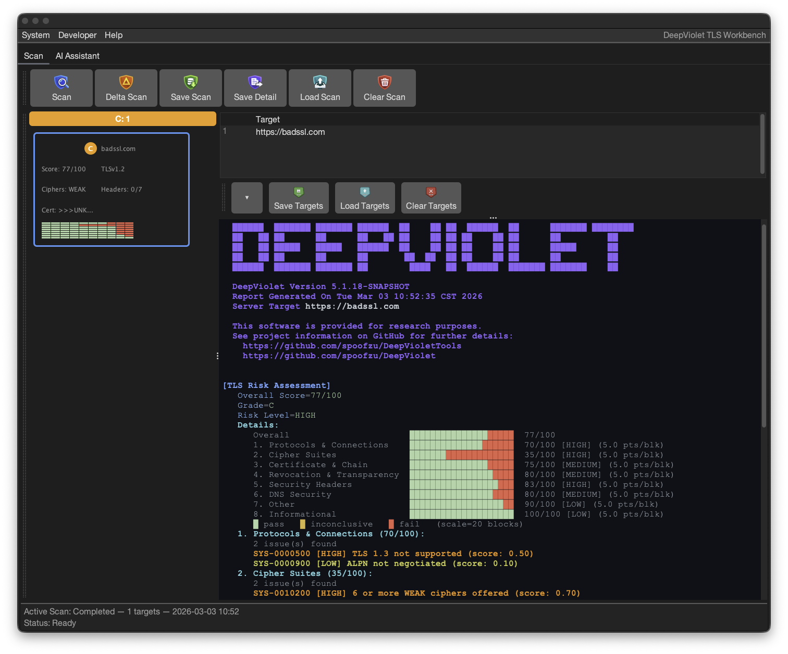
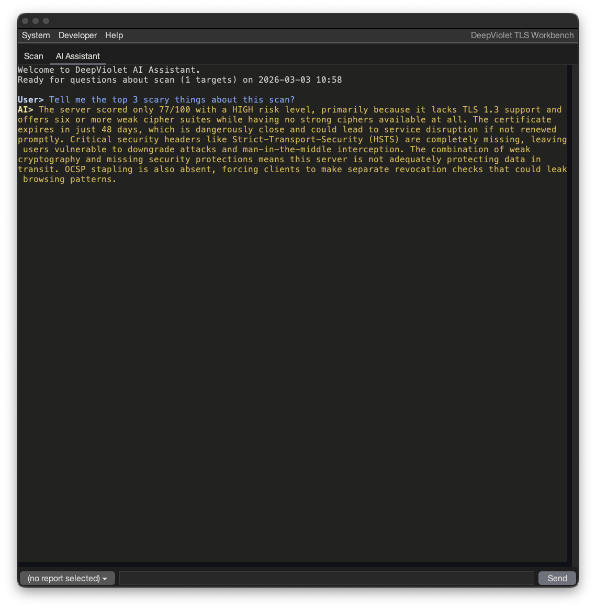
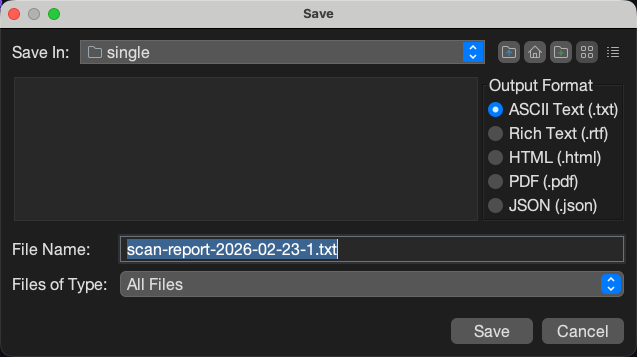
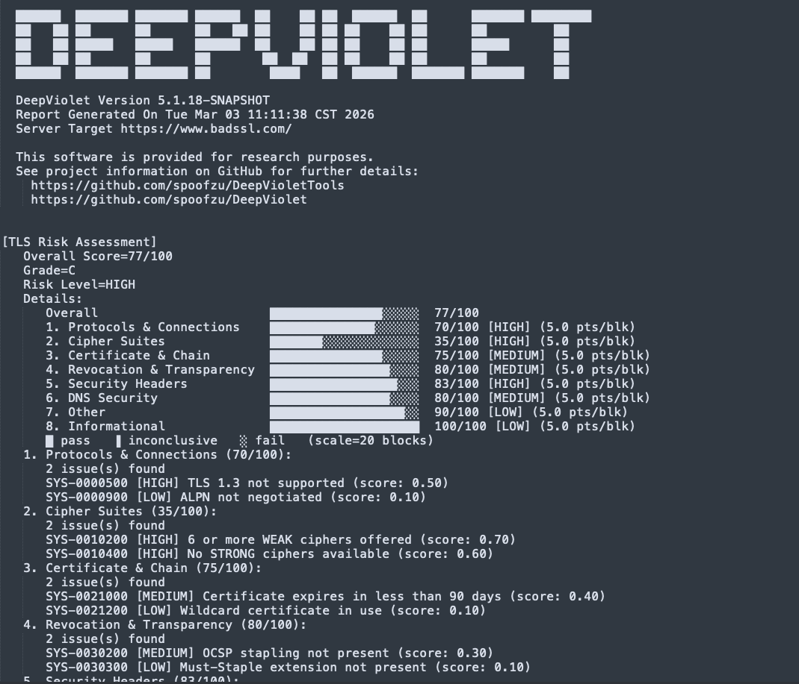

# DeepViolet Tools

TLS/SSL scanning tools for security professionals and developers

[](https://github.com/spoofzu/DeepVioletTools/actions/workflows/build.yml)
[](http://www.blackhat.com/eu-16/arsenal.html#milton-smith)
[](https://www.blackhat.com/us-18/arsenal/schedule/index.html#deepviolet-ssltls-scanning-api-38-tools-10724)

[Documentation](docs/DeepVioletTools.md) |
[Changes from Upstream](docs/CHANGES.md) |
[DeepViolet API](https://github.com/spoofzu/DeepViolet/)

---

DeepVioletTools is a suite of TLS/SSL security scanning tools with graphical and command-line interfaces. It consumes the [DeepViolet API](https://github.com/spoofzu/DeepViolet/) to scan HTTPS servers and analyze certificate trust chains, revocation status, cipher suite strength, and security headers.

[](https://youtu.be/91eera5X-lo?si=nH9p5dz2v1u1AkQQ)

## GUI Application

```bash
java -jar dvui.jar
```

Scan any HTTPS server and get a detailed TLS security report with risk assessment, certificate chain analysis, cipher suite enumeration, and more.



### AI Assistant

Ask questions about your scan results using the built-in AI assistant. Supports OpenAI, Anthropic, and local Ollama models. Configure your provider and API key in **System > Settings > AI**.



### Multi-Target Scanning

Scan multiple targets concurrently and compare results with heat map visualizations. Supports hostnames, IPs, CIDR blocks (`10.0.1.0/24`), IPv6, and dash ranges (`10.0.2.1-50`). Configurable worker threads (1–10) and throttle delay.

### Report Export

Save scan reports in multiple formats: ASCII text, Rich Text (RTF), HTML, PDF, or JSON.



## Command Line Tool

```bash
# Full scan
java -jar dvcli.jar -serverurl https://www.github.com/

# Specific sections (t=header, c=connection, s=certificate, f=fingerprint)
java -jar dvcli.jar -serverurl https://www.github.com/ -s tcsf

# Export certificate to PEM
java -jar dvcli.jar -serverurl https://www.github.com/ -wc ~/certs/github.pem

# Multi-target scan with concurrent workers
java -jar dvcli.jar --scan "github.com,google.com,example.com" --scan-threads 4

# Multi-target scan from file
java -jar dvcli.jar --scan-file targets.txt --scan-threads 4 -o scan-report.json

# Validate DV API results against openssl
java -jar dvcli.jar --validate google.com
java -jar dvcli.jar --validate expired.badssl.com
```



### CLI Options

| Option | Description |
|--------|-------------|
| `-u, --serverurl` | HTTPS URL to scan (single-host mode) |
| `-s, --sections` | Report sections to include (see below) |
| `-wc` | Write server certificate to PEM file |
| `-rc` | Read and analyze a local PEM certificate |
| `-f, --format` | Output format: `txt`, `html`, `pdf`, `json` |
| `-o, --output` | Write report to file (format inferred from extension) |
| `--scan` | Comma-separated target list (mutually exclusive with `-u`) |
| `--scan-file` | File with targets, one per line |
| `--scan-threads` | Worker thread count for multi-target scans (1–10, default 3) |
| `--scan-throttle` | Delay in ms between hosts per worker (0–10000, default 150) |
| `--delta` | Compare two saved `.dvscan` files: `--delta base.dvscan,target.dvscan` |
| `--proto-sslv3` | Enable SSLv3 protocol testing |
| `--proto-tls10` | Enable TLS 1.0 protocol testing |
| `--proto-tls11` | Enable TLS 1.1 protocol testing |
| `--proto-tls12` | Enable TLS 1.2 protocol testing |
| `--proto-tls13` | Enable TLS 1.3 protocol testing |
| `--ciphermap` | Custom cipher map YAML file (replaces built-in) |
| `--riskrules` | User risk rules YAML file (merged with system rules) |
| `-d` | Enable SSL/TLS debugging |
| `-d2` | Enable debug logging |
| `--ai` | Enable AI evaluation section in report |
| `--ai-provider` | AI provider: `anthropic`, `openai`, `ollama` |
| `--ai-model` | AI model name |
| `--ai-key` | API key (overrides saved; prefer env var `DV_AI_API_KEY`) |
| `--ai-endpoint` | Ollama endpoint URL (default: `http://localhost:11434`) |
| `--validate` | Compare DV API results against openssl for a host (requires openssl) |
| `-h` | Show help |

### Report Sections (`-s`)

| Code | Section |
|------|---------|
| `a` | TLS risk assessment (score, grade, category graph) |
| `e` | Runtime environment (Java version, OS, trust store) |
| `t` | Report header (multi-target mode) |
| `h` | Host information (DNS resolution) |
| `r` | HTTP response headers |
| `x` | Security headers analysis (HSTS, CSP, X-Frame-Options, etc.) |
| `c` | Connection characteristics |
| `i` | Cipher suites enumeration with strength evaluation |
| `s` | Server certificate chain with trust state |
| `n` | Certificate chain (alias for `s`) |
| `v` | Revocation status (OCSP, CRL, OneCRL, CT/SCTs) |
| `f` | TLS server fingerprint |

Example: `java -jar dvcli.jar -serverurl https://github.com/ -s aecsf`

## Features

- **TLS Risk Assessment** — YAML-driven scoring engine with 65 rules across 7 categories, numeric score, letter grade, and visual category breakdown. Supports user-defined risk rules merged with system rules.
- **Certificate Analysis** — Trust chains, validity, expiration, public key details (algorithm, size, EC curve), SAN enumeration, signing algorithms, OIDs
- **Cipher Suite Enumeration** — All supported ciphers with strength evaluation (IANA, OpenSSL, GnuTLS, or NSS naming). Replaceable cipher map via custom YAML definitions.
- **Revocation Checking** — OCSP, OCSP Stapling, CRL, OneCRL, Must-Staple, Certificate Transparency (SCT signature verification from embedded, TLS extension, and OCSP staple sources)
- **Security Headers** — HSTS, CSP, X-Frame-Options, X-Content-Type-Options, Permissions-Policy, and more
- **TLS Fingerprinting** — JARM-inspired 10-probe fingerprinting that characterizes server TLS behavior for grouping and change detection
- **DNS Security** — CAA and DANE/TLSA record checking
- **Fallback SCSV** — RFC 7507 TLS Fallback Signaling detection
- **Multi-Target Scanning** — Scan multiple targets concurrently with configurable worker threads (1–10), throttle delay, and CIDR/range expansion. Supports hostnames, IPv4/IPv6, CIDR blocks, and dash ranges.
- **Heat Map Visualization** — 7-dimension color-coded grids comparing scan results across hosts (Risk, Ciphers, Security Headers, Connection, HTTP Response, Revocation, Fingerprint)
- **AI Assistant** — Ask questions about scan results using OpenAI, Anthropic, or local Ollama models
- **Multi-format Export** — Save reports as text, RTF, HTML, PDF, or JSON
- **Card Layout Editor** — Drag-and-drop grid editor for customizing scan host cards: element placement, multi-cell spanning, cell alignment (Shift+click), resizable grid proportions, and live card preview
- **Theme Support** — Dark, light, and system presets with full color customization
- **Configurable Engine** — Choose report sections, cipher naming convention, and protocol versions via **System > Settings**
- **Test Server Library** — Quick access to badssl.com test servers and recent scan history
- **API Validation** — Compare DV API results against openssl field-by-field for any server; verify accuracy with expired, self-signed, and EC certificate test cases
- **PEM Export/Import** — Save and analyze certificates offline

## Requirements

- **Java 21** or later

## Building from Source

```bash
git clone https://github.com/spoofzu/DeepVioletTools.git
cd DeepVioletTools
mvn clean package
```

Produces two uber JARs in `target/`:
- `dvui.jar` — GUI application
- `dvcli.jar` — Command-line tool

## Documentation

See [docs/DeepVioletTools.md](docs/DeepVioletTools.md) for comprehensive documentation including JSON schema reference, vulnerability analysis details, and troubleshooting.

## Acknowledgements

This tool implements ideas, code, and takes inspiration from: Qualys SSL Labs and Ivan Ristic, OpenSSL, Oracle's Java Security Team, and Thomas Pornin. AI coding assistance by Claude Code AI.

## License

[Apache License, Version 2.0](LICENSE)

*This project leverages the works of other open source community projects and is provided for educational purposes. Use at your own risk.*

## Disclaimer

The author is an employee of Oracle Corporation. This project is a personal endeavor and is not affiliated with, sponsored by, or endorsed by Oracle. All views and code are the author's own.
